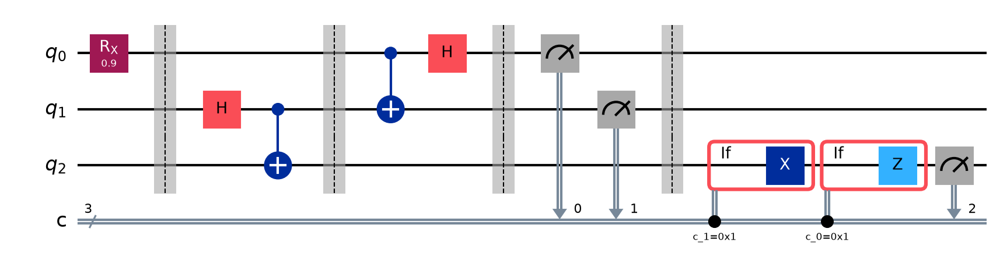

# Quantum Teleportation

A Qiskit simulation of the quantum teleportation protocol, with a statevector
fidelity check proving correctness and a step-by-step Jupyter walkthrough for
presenting the protocol.


## What is quantum teleportation?

Quantum teleportation is a protocol that moves an unknown qubit's state |ψ⟩
from one location to another, without physically moving the qubit itself and
without measuring (and thus destroying) the state directly. It uses:

- One pair of qubits pre-shared in an entangled **Bell state** (the resource).
- **Two classical bits** sent from the sender (Alice) to the receiver (Bob)
  over an ordinary classical channel.

Nothing here violates relativity or lets information travel faster than
light: Bob cannot recover |ψ⟩ until Alice's two classical bits physically
arrive. No matter or energy is transported — only quantum *information*. And
the original qubit's state is destroyed the moment Alice measures it, so this
does not clone the state (consistent with the no-cloning theorem).

### How it works

1. **Prepare |ψ⟩** — the qubit to teleport (`q0`) is put into some state,
   unknown to Alice.
2. **Create a Bell pair** — Alice and Bob each hold one qubit (`q1`, `q2`) of
   an entangled pair, created ahead of time and distributed between them.
3. **Entangle q0 with Alice's half of the pair** — a CNOT + Hadamard between
   `q0` and `q1` rotates the 3-qubit system into the Bell basis.
4. **Alice measures q0 and q1** — this yields two random classical bits
   `(m0, m1)`, each outcome equally likely, and destroys |ψ⟩ on her side.
5. **Bob corrects his qubit** — using `(m0, m1)` sent over a classical
   channel, Bob applies `X` and/or `Z` to `q2` as needed. Afterwards `q2` is
   in exactly the original state |ψ⟩:

   | m0 | m1 | Correction |
   |----|----|------------|
   | 0  | 0  | none |
   | 0  | 1  | X |
   | 1  | 0  | Z |
   | 1  | 1  | X then Z |



### Why the correction works, in the math

Let |ψ⟩ = α|0⟩ + β|1⟩ be the state on `q0`, and let `q1`,`q2` start in the
Bell state |Φ+⟩ = (|00⟩+|11⟩)/√2. The combined 3-qubit input is:

```
|ψ⟩ ⊗ |Φ+⟩ = (1/√2)(α|000⟩ + α|011⟩ + β|100⟩ + β|111⟩)
```

Applying CNOT(`q0`→`q1`) then H(`q0`) rewrites this exactly into the four
Bell states on (`q0`,`q1`), each paired with a specific state on `q2`
(kets ordered q0 q1, then q2):

```
(1/2) [ |00⟩(α|0⟩+β|1⟩) + |01⟩(α|1⟩+β|0⟩)
      + |10⟩(α|0⟩−β|1⟩) + |11⟩(α|1⟩−β|0⟩) ]
```

Measuring `q0`→`m0` and `q1`→`m1` collapses this to exactly one of the four
branches (25% probability each) — but in every branch, `q2` already holds
|ψ⟩ up to a known Pauli correction:

| m0 | m1 | q2 before correction | Correction |
|----|----|-----------------------|------------|
| 0  | 0  | α\|0⟩+β\|1⟩           | none |
| 0  | 1  | α\|1⟩+β\|0⟩           | X |
| 1  | 0  | α\|0⟩−β\|1⟩           | Z |
| 1  | 1  | α\|1⟩−β\|0⟩           | X then Z |

Applying `X` when `m1=1` and `Z` when `m0=1` always returns `q2` to exactly
α|0⟩+β|1⟩ = |ψ⟩ — which is precisely what `verify_fidelity()` confirms
numerically (fidelity = 1.0 on every trial, for every branch).

## Project Structure

- **[main.py](main.py)** — the circuit and its verification.
  - `quantum_teleportation(theta=0.9)` builds the 3-qubit circuit above,
    preparing |ψ⟩ = `Rx(theta)|0⟩` on `q0`. Corrections use Qiskit's
    classical control-flow (`if_test`), the current replacement for the
    deprecated `.c_if()` (removed in Qiskit 2.0).
  - `verify_fidelity(theta, trials, seed)` proves the protocol actually
    works: it simulates the full statevector (not just sampled bits) for
    each trial, traces out Alice's two qubits, and computes the **fidelity**
    between Bob's resulting qubit and the original |ψ⟩. A fidelity of `1.0`
    across every trial confirms teleportation succeeds regardless of which
    random outcome Alice measures.
  - Running the file directly (`python main.py`) prints a 1000-shot raw
    measurement histogram, followed by the fidelity check.
- **[teleportation_walkthrough.ipynb](teleportation_walkthrough.ipynb)** — a
  presentation-friendly notebook that builds the circuit one protocol step
  at a time, drawing the circuit diagram and Bloch spheres as it goes, then
  contrasts the raw measurement histogram (which alone doesn't prove
  anything) against the fidelity verification, including a sanity check
  across several different input states.

## How to run

### Locally, with a virtual environment

```powershell
python -m venv venv
.\venv\Scripts\Activate.ps1
pip install -r requirements.txt

python main.py                                   # run the circuit + fidelity check
jupyter notebook teleportation_walkthrough.ipynb  # open the walkthrough
```

### On Google Colab

Colab runs the notebook on a temporary Google cloud VM instead of your own
machine, so nothing needs to be installed locally:

1. Go to [colab.research.google.com](https://colab.research.google.com) →
   **File → Upload notebook** → select `teleportation_walkthrough.ipynb`.
2. Add a cell at the top with:
   ```
   !pip install qiskit qiskit-aer matplotlib pylatexenc
   ```
3. Run all cells.

## Requirements

`qiskit`, `qiskit-aer`,
`matplotlib`, `pylatexenc`, `jupyter`.

## License

MIT — see [LICENSE](LICENSE).
